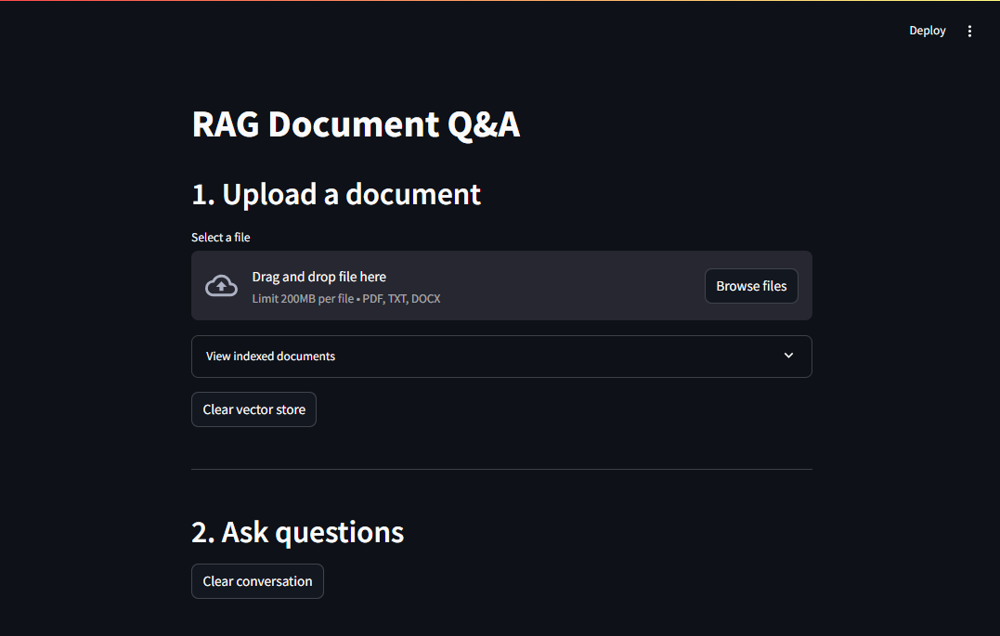
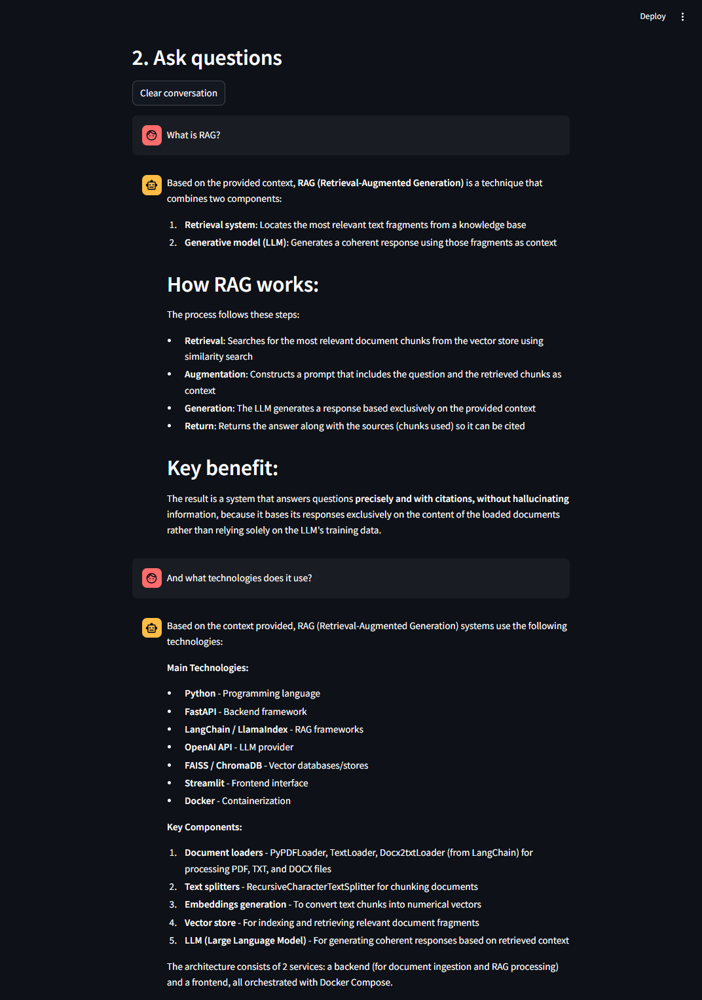
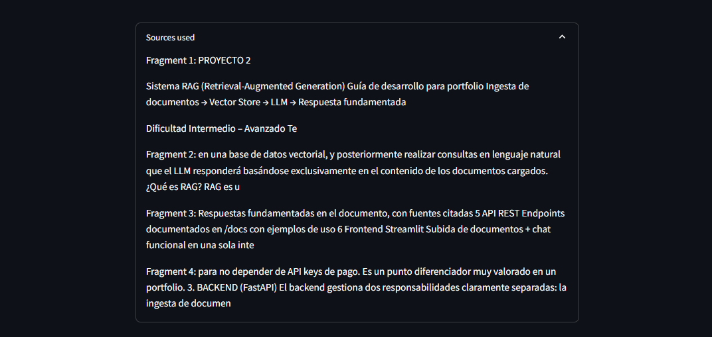
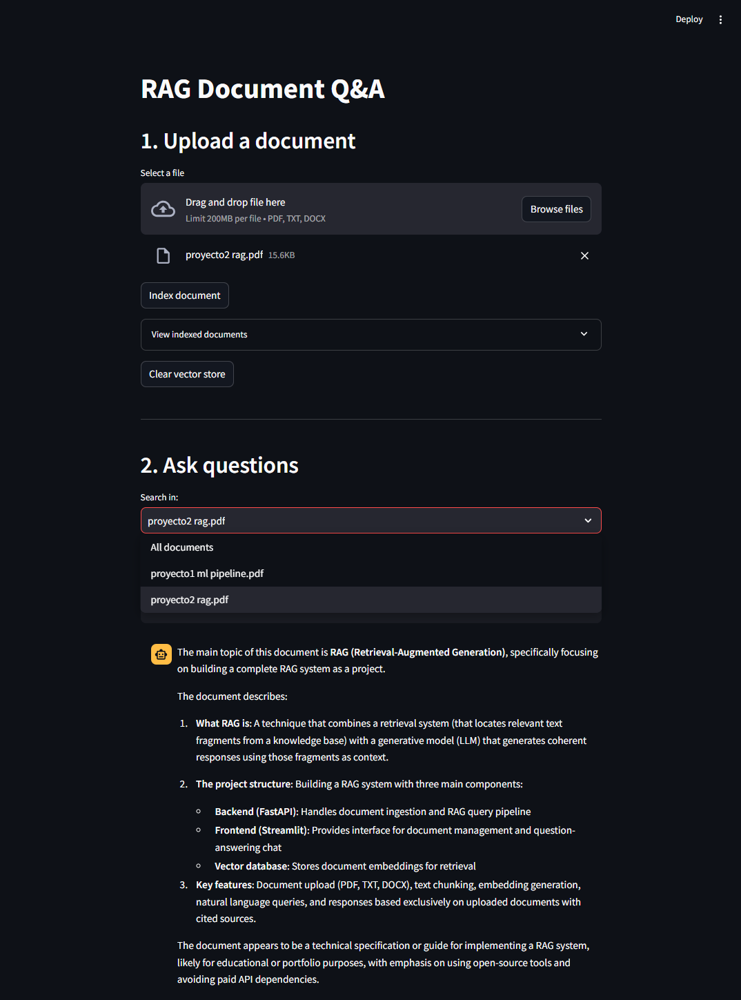
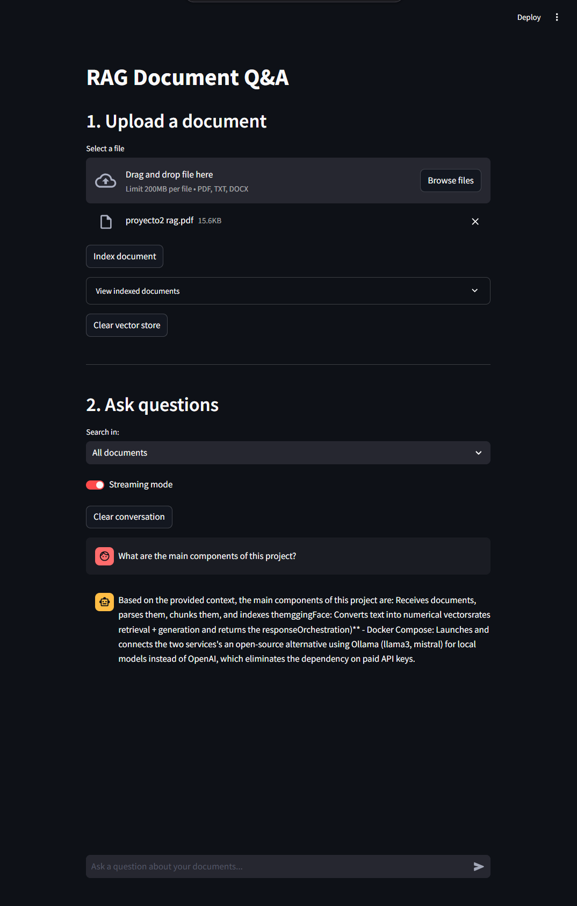

# RAG Document Q&A

A production-ready Retrieval-Augmented Generation (RAG) system that allows users to upload documents and ask questions in natural language. Answers are generated exclusively from the uploaded document content using Claude as the LLM. Supports multiple documents, document-level filtering, and conversation memory across multiple turns.


---

## Overview

Users upload PDF, TXT, or DOCX files. The system splits them into chunks, embeds them using a local HuggingFace model, and stores the vectors in a FAISS index. When a question is asked, the most relevant chunks are retrieved and passed to Claude along with the conversation history. Users can search across all documents or filter by a specific one.

---

## Architecture

```
+---------------------------------------------------------+
|                    Docker Compose                       |
|                                                         |
|  +-----------------+        +----------------------+   |
|  |   Frontend      |        |   Backend            |   |
|  |   Streamlit     |------->|   FastAPI            |   |
|  |   :8501         |  HTTP  |   :8000              |   |
|  +-----------------+        +----------+-----------+   |
|                                         |               |
|                              +----------v-----------+   |
|                              |  Ingestion Pipeline  |   |
|                              |  PyPDF / TextLoader  |   |
|                              |  RecursiveTextSplit  |   |
|                              |  HuggingFace Embed   |   |
|                              |  Metadata tagging    |   |
|                              +----------+-----------+   |
|                                         |               |
|                              +----------v-----------+   |
|                              |  FAISS Vector Store  |   |
|                              |  (persisted volume)  |   |
|                              +----------+-----------+   |
|                                         |               |
|                              +----------v-----------+   |
|                              |  RAG Pipeline        |   |
|                              |  HyDE pre-retrieval  |   |
|                              |  Retrieve k=4 chunks |   |
|                              |  Document filtering  |   |
|                              |  Conversation Memory |   |
|                              |  Claude Sonnet       |   |
|                              |  SSE streaming       |   |
|                              +----------------------+   |
+---------------------------------------------------------+
```

---

## Tech Stack

| Layer | Technology |
|---|---|
| Backend API | FastAPI + Uvicorn |
| Frontend | Streamlit |
| LLM | Claude (claude-sonnet-4-5) via Anthropic API |
| Embeddings | sentence-transformers/all-MiniLM-L6-v2 |
| Vector Store | FAISS (faiss-cpu) |
| Orchestration | LangChain + LangChain-Anthropic |
| Conversation Memory | ConversationBufferMemory |
| Document Loaders | PyPDF, TextLoader, Docx2txt |
| Infrastructure | Docker Compose |

---

## Project Structure

```
rag-project/
├── backend/
│   ├── Dockerfile
│   ├── requirements.txt
│   └── src/
│       ├── main.py          # FastAPI app and endpoints
│       ├── ingestion.py     # Document loading, chunking, embedding, FAISS indexing
│       ├── retrieval.py     # RAG pipeline with conversation memory and filtering
│       └── models.py        # Pydantic schemas
├── frontend/
│   ├── Dockerfile
│   ├── requirements.txt
│   └── app.py               # Streamlit UI
├── vectorstore/             # Persisted FAISS index (Docker volume)
├── docs/
│   └── screenshots/
├── docker-compose.yml
└── .env                     # ANTHROPIC_API_KEY (not committed)
```

---

## API Endpoints

| Method | Endpoint | Description |
|---|---|---|
| GET | `/health` | Service status and vector store info |
| GET | `/documents` | List of indexed documents |
| POST | `/ingest` | Upload and index a document |
| POST | `/query` | Ask a question with optional document filter |
| POST | `/stream` | Ask a question — streams tokens via SSE |
| DELETE | `/memory` | Clear conversation memory |
| DELETE | `/vectorstore` | Clear all indexed documents and memory |

---

## Data Models

```python
class QueryRequest(BaseModel):
    question: str
    filter_document: Optional[str] = None  # Filter by specific document

class QueryResponse(BaseModel):
    answer: str
    sources: list[str]

class IngestResponse(BaseModel):
    chunks_indexed: int
    filename: str

class HealthResponse(BaseModel):
    status: str
    vectorstore: bool
    documents: int

class DocumentsResponse(BaseModel):
    documents: list[str]
```

---

## Screenshots

### Home


### Conversation memory


### Sources used


### Document filter


### Streaming


---

## Setup and Run

### Requirements

- Docker Desktop
- Anthropic API key

### Steps

1. Clone the repository:

```bash
git clone https://github.com/DevJonAI/rag-document-qa.git
cd rag-document-qa
```

2. Create the `.env` file:

```
ANTHROPIC_API_KEY=your_api_key_here
```

3. Build and run:

```bash
docker-compose up --build
```

4. Open the app at `http://localhost:8501`

---

## How It Works

1. Upload one or more PDF, TXT, or DOCX files and click "Index document" for each
2. The backend splits each document into chunks of 800 tokens with 150-token overlap
3. Each chunk is stored with its source filename as metadata
4. Select a specific document to filter search, or use "All documents" to search across everything
5. Ask a question in the chat input
6. The system generates a hypothetical answer to the question (HyDE) and uses
   it as the retrieval query to improve chunk relevance, then retrieves the 4
   most similar chunks and passes them to Claude along with the conversation history
7. Claude generates an answer based exclusively on the retrieved content
8. Follow-up questions are answered with awareness of previous exchanges
9. The "Sources used" section shows the exact fragments used

---

## Planned improvements

- **RAGAS evaluation** — `evaluate.py` is written and committed. Uses the
  [RAGAS framework](https://github.com/explodinggradients/ragas) to score answer
  faithfulness, context recall, and answer relevancy. Not integrated into Docker
  Compose yet due to disk space constraints; planned as a standalone evaluation step.
- **Ollama integration** — replace the Anthropic API with a local model (llama3 or
  mistral via Ollama) for fully offline, API-key-free operation.
- **ChromaDB migration** — replace FAISS with ChromaDB for native metadata filtering
  and better scalability.

---

## Author

Jonathan - [GitHub](https://github.com/DevJonAI)
